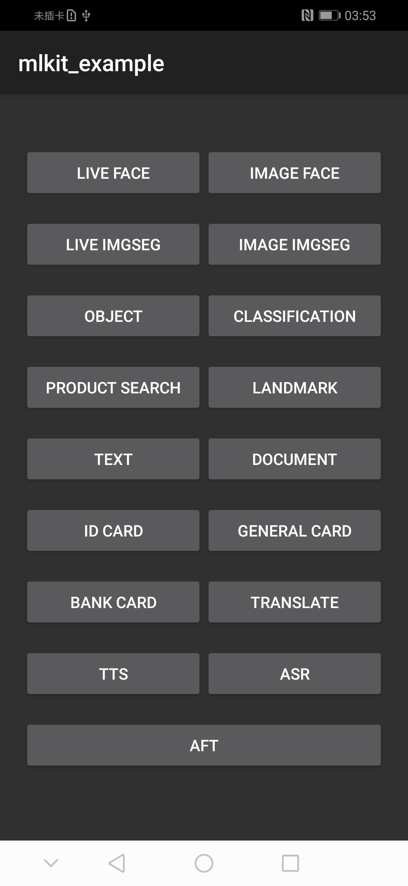
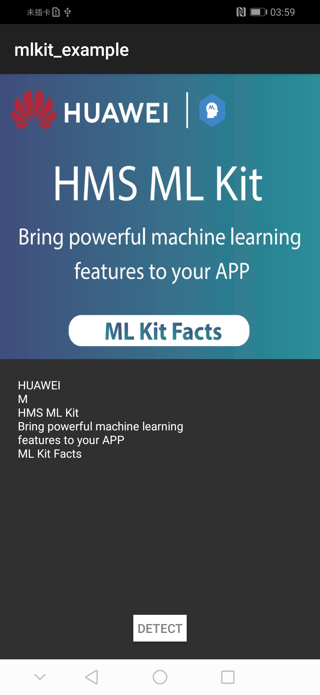
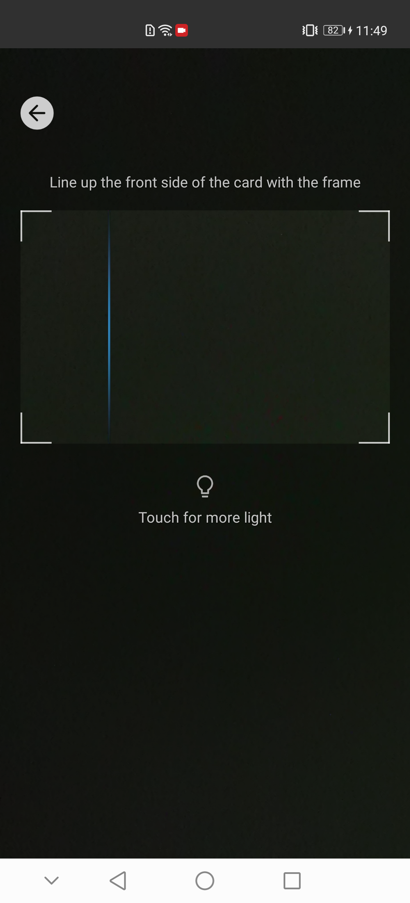
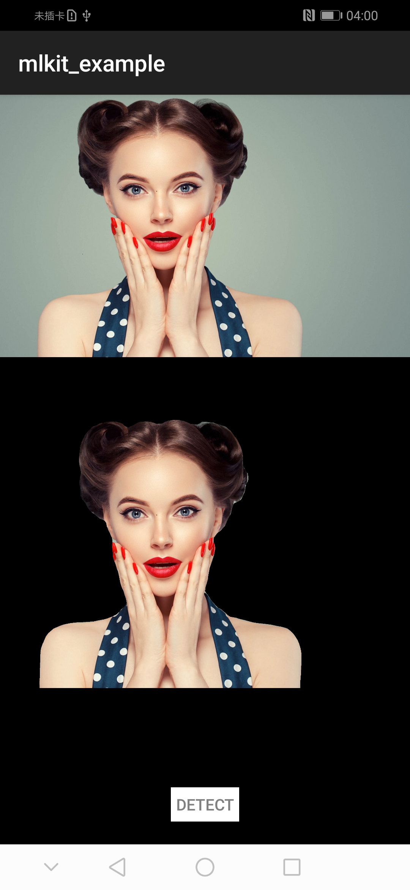
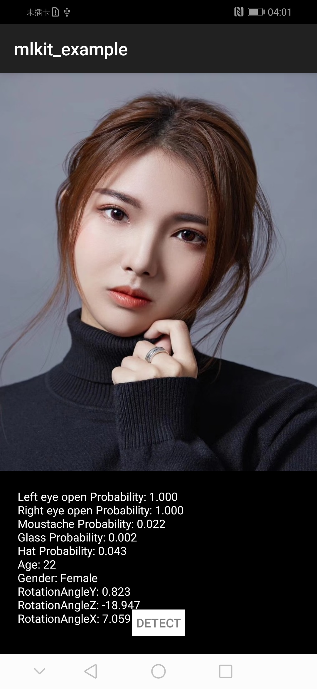
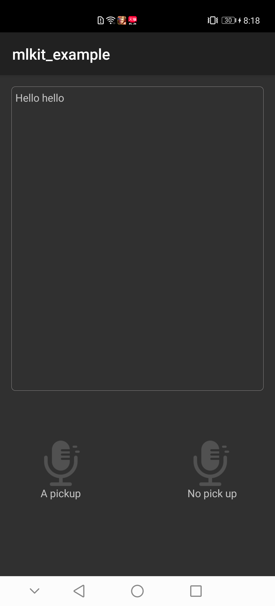

# HUAWEI ML Kit

## Table of Contents

 * [Introduction](#introduction)
 * [Getting Started](#Getting Started)
 * [Supported Environments](#supported-environments)
 * [Result](#result)
 * [License](#license)

## Introduction
    The sample code describes how to use the HMS Core ML SDK.

    aft:                 Sample code of audio file transcription.
    asr:                 Sample code of automatic speech recognition.
    bankCard:            Sample code of bank card recognition.
    camera:              Sample code of lensEngine.
    classification:      Sample code of image classification.
    document:            Sample code of document recognition.
    face:                Sample code of face detection.
    generalCard:         Sample code of general card recognition.
    IDCard:              Sample code of ID card recognition.
    imgseg:              Sample code of image segmentation.
    landmark:            Sample code of landmark recognition.
    object:              Sample code of object detection and tracking.
    productvisionsearch: Sample code of product visual search.
    text:                Sample code of text recognition.
    translate:           Sample code of text translation.
    tts:                 Sample code of text to speech.

## Getting Started
### 1. Register as a developer.
    Before you get started, you must register as a HUAWEI developer and complete identity verification on [HUAWEI Developers](https://developer.huawei.com/consumer/en/). For details, please refer to [Registration and Verification](https://developer.huawei.com/consumer/en/doc/start/10104).
### 2. Create an app and apply for a agconnect-services.json.
	Create an app and set package type to APK (android app). Apply for the agconnect-services.json file on HUAWEI Developers. For details, please refer to [Adding the AppGallery Connect Configuration File.](https://developer.huawei.com/consumer/en/doc/development/HMS-Guides/ml-add-agc).
### 3. Replacing api_key.
    Copy the api_key in the agconnect-services.json and assign the value to the apiKey constant in MainActivity.
### 4. Build
    To build this sample, import the sample to Android Studio (3.x +), download agconnect-services.json from AppGallery Connect, and add the file to the app's root directory app of the demo app.
### 5. Run the sample on your Android device or emulator.

## Supported Environments
	Devices with Android 4.4 or later are recommended.
##Result

##  License
    The sample of HUAWEI ML Kit has obtained the [Apache 2.0 license.](https://www.apache.org/licenses/LICENSE-2.0).